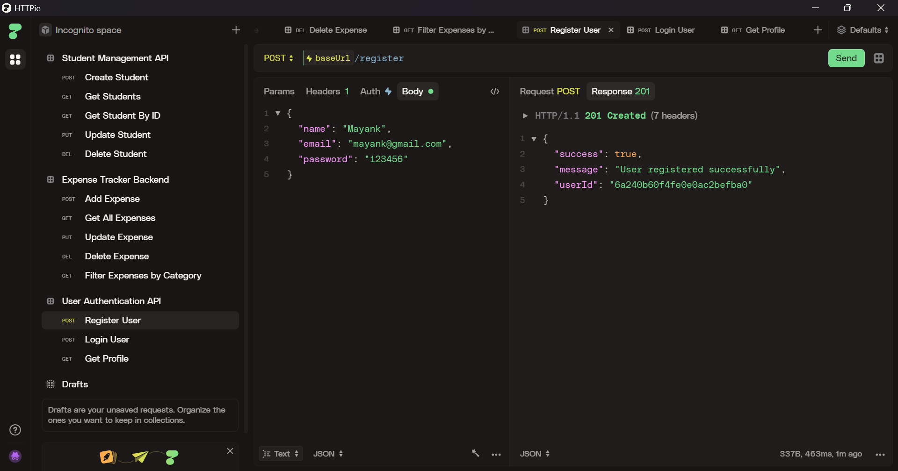
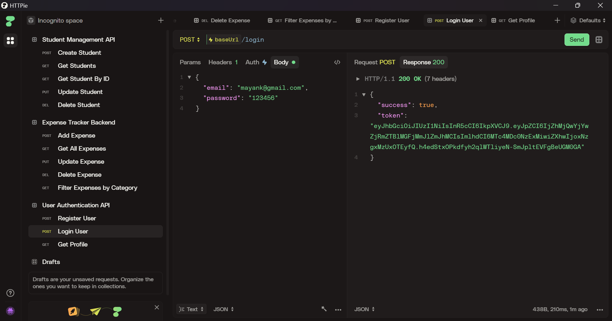
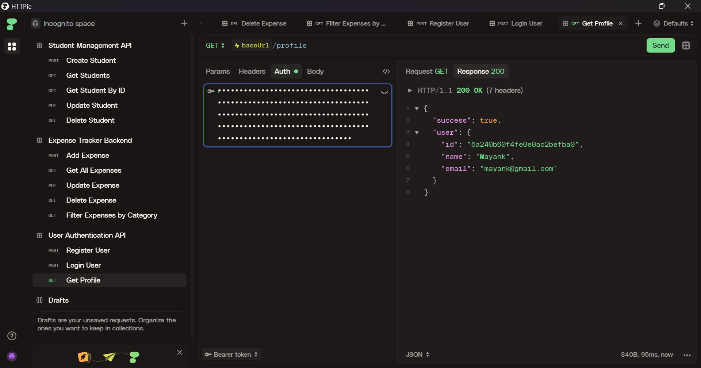

# User Authentication System

A backend API for user registration, login, and profile retrieval using Node.js, Express, MongoDB, JWT, and bcrypt.

## Setup

1. Copy `.env.example` to `.env`.
2. Install dependencies:

```bash
npm install
```

3. Start the server:

```bash
npm run dev
```

4. Use Postman or another HTTP client to test endpoints.

## API Endpoints

- `POST /register` - Register a new user.
- `POST /login` - Login with email and password.
- `GET /profile` - Get the logged-in user profile.

## Notes

- The `Authorization` header must include `Bearer <token>` for protected requests.
- Passwords are hashed using `bcryptjs` and JWT tokens are signed with `JWT_SECRET`.

## API Demo Screenshots

### Register User


*Register a new user with a name, email, and password.*

### Login User


*Log in with registered credentials to receive a JWT token.*

### Get Profile


*Fetch the authenticated user profile using the Bearer token.*
